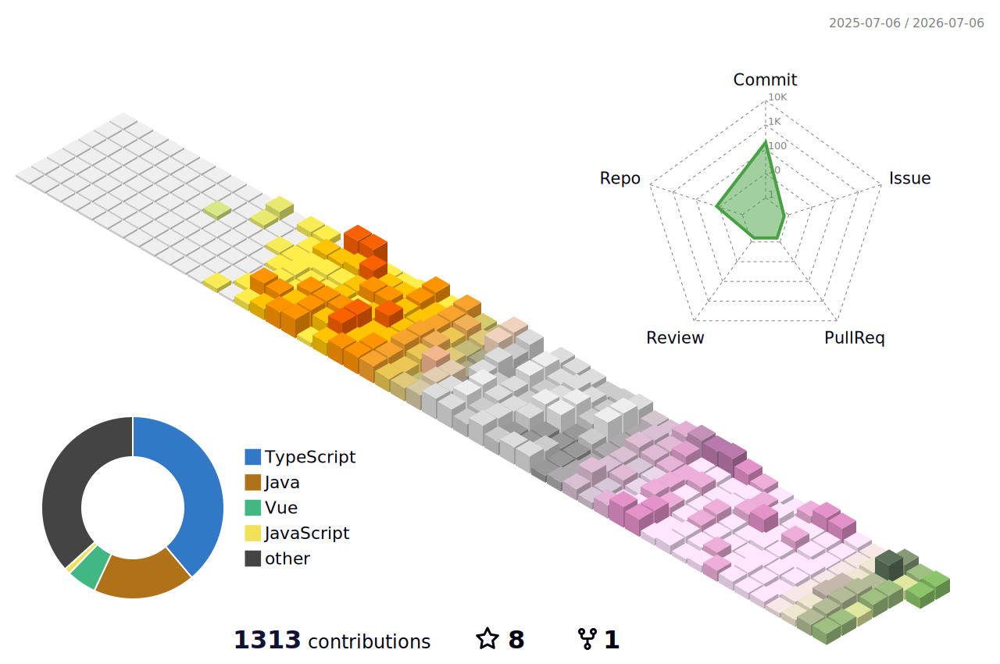

<h1 align="center">Hello World! I'm Sangyu 👋</h1>

  <a href="https://github.com/<your-username>"></a>
  <a href="https://www.linkedin.com/in/<your-handle>/"></a>
  <a href="mailto:2249736997@qq.com>"></a>
  

## 🧭 About Me
- 🏫 **目前就读浙江科技大学-计算机科学与技术专业**
## 🎯 Current Focus
### 🧠 主线任务
- 🎓 **毕业设计**：终于到了写自己的毕业设计了
- 🧩 **开源组件库 × 2**：开发自己的组件库，react一套，vue一套
### 📌 寻找自己  
- 🌱 我的爱好：**热爱编程、足球、爬山、旅行、喜欢穷游、魔方**
- 🌿 **日常使用typescript和java语言，偏前端**
- 🎯 未来打算：**希望能成为全栈，写出自己的程序**
- 🧰 常用栈：**TypeScript / React / Node.js / Ant Design / Vue / Electron / springboot**
- 💬 欢迎交流：**前端工程化、Monorepo、CI/CD、RBAC 权限、JWT 认证**
- ⚡ 梦想：**去阿尔卑斯放羊**
- 👯 个人博客[blog](https://www.sangyu.asia/)

## 🛠 Tech Stack

  <!-- Languages -->
  
  
  
  <!-- Frontend -->
  
  
  
  
  <!-- Tooling -->
  
  
  
  
  
  

## 🚀 Featured Projects
- **项目 ai桌面助手**  
  简介: 与ai大模型对话的桌面应用软件   
  技术：TypeScript, Vue , Electron , Node  
- **项目 个人博客**  
  简介：记录自己的学习的博客
  技术：vitepress, CI/CD  

> 💡 还有很多项目在本地，没有上传github：

## 📊 GitHub Stats

|||
|:---:|:---:|

