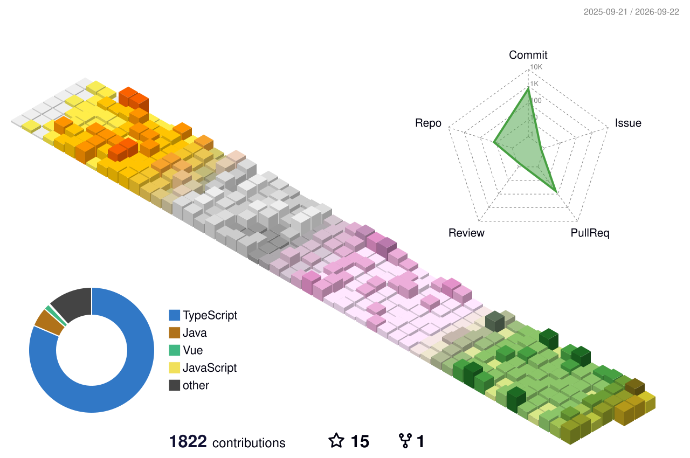

<h1 align="center">Hello, I'm Sangyu 👋</h1>

  <strong>Frontend Engineer · Component Library Builder · Exploring AI Agents</strong>

  
  
  
  

## 🧭 About Me

- 🎓 毕业于浙江科技大学，计算机科学与技术专业。
- 💼 目前在职，好好上班。
- 🧩 正在打造两套开源组件库：一套基于 **React**，一套基于 **Vue**。
- 🤖 正在系统学习 LLM 应用与 AI Agent，关注它们如何真正融入开发工具和桌面应用。
- 🚀 从前端出发，持续补齐 Node.js、Java 与后端工程能力，目标是独立构建完整产品。
- 💬 乐于交流：前端工程化、Monorepo、CI/CD、RBAC 权限设计、JWT 认证。
- 🌿 工作之外喜欢足球、爬山、旅行、穷游和魔方；理想是在阿尔卑斯山脚下放羊。

## 🎯 Current Focus

- 深耕 **TypeScript / React / Vue**，提升组件设计与工程化能力。
- 推进个人组件库从 API 设计、文档到发布的完整闭环。
- 通过真实项目实践 **Electron、Node.js 与 Spring Boot**，向全栈方向成长。
- 学习 **AI Agent** 的基础能力与工程实践：模型调用、工具调用、工作流编排和应用落地。

## 🛠 Tech Stack

  
  
  
  
  
  
  
  
  
  
  
  

## 🚀 Featured Projects

| Project | Description | Stack |
| :-- | :-- | :-- |
| [NovaPanel](https://github.com/phellinus/NovaPanel) | 面向 AI 大模型对话的桌面应用，持续探索 Agent 能力与本地桌面端交互。 | TypeScript · Vue · Electron · Node.js |
| [Personal Blog](https://www.sangyu.asia/) | 记录学习、实践与思考的个人博客。 | VitePress · CI/CD |
| [React Template](https://github.com/phellinus/react-template) | 面向日常开发的 React 项目模板与工程化实践。 | React · TypeScript · Vite |

> 还有一些仍在打磨的本地项目，准备好后会逐步开源。

## 📊 GitHub Activity

<!-- These static SVGs are generated daily by .github/workflows/profile-summary-cards.yml. -->

  

  
  

## 📈 Contribution Timeline

<!-- Keep the existing 3D contribution visual generated by your original workflow. -->

## 🐍 Contribution Snake

<picture>
  <source media="(prefers-color-scheme: dark)" srcset="https://raw.githubusercontent.com/phellinus/phellinus/output/github-contribution-grid-snake-dark.svg" />
  <source media="(prefers-color-scheme: light)" srcset="https://raw.githubusercontent.com/phellinus/phellinus/output/github-contribution-grid-snake.svg" />
  
</picture>

---

Thanks for stopping by — happy to connect and build something useful together.

